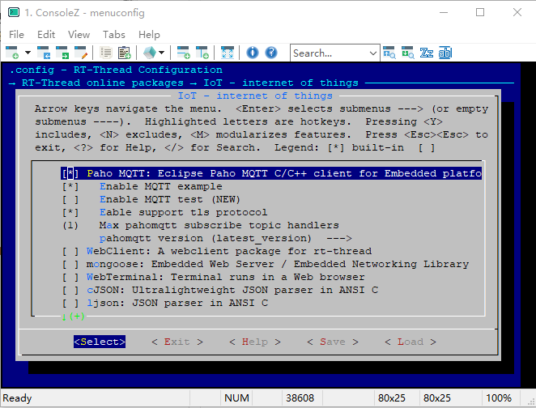

# paho-mqtt
[MQTT](http://mqtt.org/)（Message Queuing Telemetry Transport，消息队列遥测传输协议），是一种基于发布/订阅（publish/subscribe）模式的“轻量级”通讯协议，该协议构建于TCP/IP协议上，由 IBM 在 1999 年发布。

## 1、介绍
[Paho MQTT](http://www.eclipse.org/paho/downloads.php) 是 Eclipse 实现的 MQTT 协议的客户端，本软件包是在 Eclipse [paho-mqtt](https://github.com/eclipse/paho.mqtt.embedded-c) 源码包的基础上设计的一套 MQTT 客户端程序。

RT-Thread MQTT 客户端功能特点：
- 断线自动重连
- pipe 模型，非阻塞 API
- 事件回调机制

## 2、获取方式
- 使用 menuconfig
```
  RT-Thread online packages --->
      IOT internet of things --->
          [*] Paho MQTT: Eclipse Paho MQTT C/C++ client for Embedded platforms
          [*]     Enable MQTT example
          (1)     Max pahomqtt subscribe topic handlers
                  pahomqtt version (latest_version)
```

## 3、示例介绍
### 3.1 获取示例

- 配置使能示例选项 `Enable MQTT example`;
- 设置 MQTT 能订阅的最大 topic 主题数量 `Max pahomqtt subscribe topic handlers`;
- 配置包版本选为最新版 `latest_version` .



### 3.2 运行示例
在 RT-Thread 串口 MSH 中运行 MQTT 示例，需要开启 MSH 的支持。

- 开启 MSH  
使用 menuconfig 开启 MSH 支持：
```
  RT-Thread Components --->
      Command shell --->
          [*] Using module shell
          [*]     Using module shell in default
          [ ]     Only using module shell
```
- MSH log
```
msh />
msh />mq_start
inter mqtt_connect_callback! 
ipv4 address port: 1883
[MQTT] HOST =  'iot.eclipse.org'
msh />[MQTT] Subscribe #0 /mqtt/test OK!
inter mqtt_online_callback! 
msh />
msh />
msh />mq_pub hello-rtthread
msh />mqtt sub callback: /mqtt/test hello-rtthread

msh />
```

## 4、 关键代码及 API 说明

### 4.1 callback
paho-mqtt 使用 callback 的方式向用户提供 MQTT 的工作状态以及相关事件的处理， 在 `MQTTClient` 结构体实例中注册使用。

|callback 名称                           |描述|
|:-----                                  |:----|
|connect_callback                        |MQTT 连接成功的回调|
|online_callback                         |MQTT 客户端成功在线的回调|
|offline_callback                        |MQTT 客户端掉线的回调|
|defaultMessageHandler                   |默认的订阅消息接收回调|
|messageHandlers[x].callback             |订阅列表中对应的订阅消息接收回调|

用户可以使用 `defaultMessageHandler` 回调默认处理接收到的订阅消息，也可以使用 `messageHandlers` 订阅列表，为 `messageHandlers` 数组中对应的每一个 topic 提供一个独立的订阅消息接收回调。

### 4.2 MQTT_URI

paho-mqtt 中提供了 uri 解析功能，可以解析域名地址、ipv4和ipv6地址，可解析 `tcp://` 和 `ssl://` 类型的 URI，用户需要按照要求填写可用的 URI 即可。

示例 URI：
```
domain 类型
tcp://iot.eclipse.org:1883

ipv4 类型
tcp://192.168.10.1:1883
ssl://192.168.10.1:1884

ipv6 类型
tcp://[fe80::20c:29ff:fe9a:a07e]:1883
ssl://[fe80::20c:29ff:fe9a:a07e]:1884
```

### 4.3 MQTTPublish 接口
- `MQTTPublish` 功能： 向指定的 topic 主题发布 MQTT 消息。

- `MQTTPublish` 函数原型：
```C
int MQTTPublish(MQTTClient *c, const char *topicName, MQTTMessage *message)
```
- `MQTTPublish` 函数参数：

|参数                               |描述|
|:-----                             |:----|
|c                                  |MQTT 客户端实例对象|
|topicName                          |MQTT 消息发布主题|
|message                            |MQTT 消息内容|
|return                             |0 - 成功; others - 失败|


## 5、注意事项

- 正确填写 `MQTT_USERNAME` 和 `MQTT_PASSWORD`  
如果 `MQTT_USERNAME` 和 `MQTT_PASSWORD` 填写错误，MQTT 客户端无法正确连接到 MQTT 服务器。

## 6、参考资料

- [MQTT 官网](http://mqtt.org/)
- [Paho 官网](http://www.eclipse.org/paho/downloads.php)
- [IBM MQTT 介绍](https://www.ibm.com/developerworks/cn/iot/iot-mqtt-why-good-for-iot/index.html)
- [Eclipse paho.mqtt 源码](https://github.com/eclipse/paho.mqtt.embedded-c)
