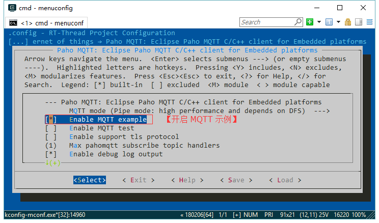

# MQTT 使用说明

## 准备工作

首先需要下载 MQTT 软件包，并将软件包加入到项目中。在 BSP 目录下使用 menuconfig 命令打开 env 配置界面，在 `RT-Thread online packages → IoT - internet of things`  中选择 paho-mqtt 软件包，操作界面如下图所示：


开启功能示例，便于测试 MQTT 功能：



配置项介绍如下：

````shell
 --- Paho MQTT: Eclipse Paho MQTT C/C++ client for Embedded platforms  
     MQTT mode (Pipe mode: high performance and depends on DFS)  --->#高级功能   
     [*]   Enable MQTT example              #开启 MQTT 功能示例     
     [ ]   Enable MQTT test                 #开启 MQTT 测试例程    
     [ ]   Enable support tls protocol      #开启 TLS 安全传输选项      
     (1)   Max pahomqtt subscribe topic handlers  #设置 Topic 最大订阅数量 
     [*]   Enable debug log output          #开启调试Log输出                      
     version (latest)  --->                 #选择软件包版本，默认为最新版
````
选择合适的配置项后，使用 pkgs--update 命令下载软件包并添加到工程中即可。

## 使用流程

软件包添加到工程后，编译下载后重新运行，可以在 msh 终端看到如下命令：

```shell
msh />
RT-Thread shell commands:
mq_start         - startup mqtt client      # 启动 MQTT 客户端
mq_pub           - publish mqtt msg         # 向指定客户端推送消息
```

## 运行效果

演示示例可以展示连接服务器、订阅 Topic、向指定 Topic 推送消息的功能，如下所示：

```shell
msh />mq_start 
inter mqtt_connect_callback!        
ipv4 address port: 1883
[MQTT] HOST =  'iot.eclipse.org'
msh />[MQTT] Subscribe 
inter mqtt_online_callback!   
msh />mq_pub hello-rtthread       
msh />mqtt sub callback: /mqtt/test hello-rtthread   
```

## 注意事项

- 正确填写 `MQTT_USERNAME` 和 `MQTT_PASSWORD`  
如果 `MQTT_USERNAME` 和 `MQTT_PASSWORD` 填写错误，MQTT 客户端无法正确连接到 MQTT 服务器。

## 参考资料

- [MQTT 官网](http://mqtt.org/)
- [Paho 官网](http://www.eclipse.org/paho/downloads.php)
- [IBM MQTT 介绍](https://www.ibm.com/developerworks/cn/iot/iot-mqtt-why-good-for-iot/index.html)
- [Eclipse paho.mqtt 源码](https://github.com/eclipse/paho.mqtt.embedded-c)
